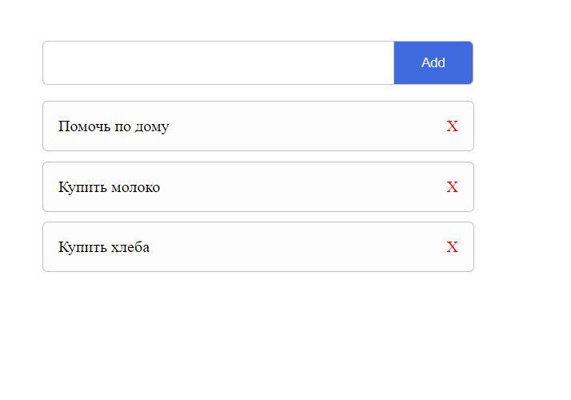

## Установка

1. `cd todo-list`
2. `npm intall`
3. `npm run dev`

## Техническое задание

Сделать TODO-лист как на картинке ниже:

### Требования

1. Возможность добавить задачу;
2. Возможность посмотреть все свои задачи;
3. При перезагрузке страницы задания должны оставаться (использовать `cookies` или `localstorage`);
4. Возможность удалить задачу;
5. При удалении задачи должно появляться модальное окно с текстом "Задача успешно удалена".